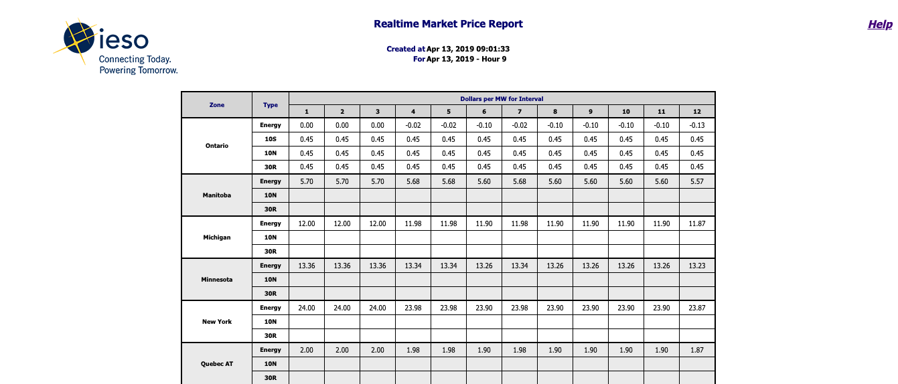

# Programming Assignment: Parsing Data

Voltus participates in dozens of energy markets across the USA and Canada.  Each market operator publishes reports about electricity demand and pricing at various temporal and spatial frequencies.  The data from these reports is critical to Voltus' current operations and our future product development.  

We expect this assignment to take about an hour.  Feel free to leverage open source libraries to speed up the parsing process.

## Index

- [The Dataset](#the-dataset)
- [The Project](#the-project)
- [Extensions](#extensions)
- [Deliverables](#deliverables)

## The Dataset

In the `data/` directory are 10 xml Realtime Market Price Reports from the [Independent Electricity System Operator (IESO)'s](http://www.ieso.ca/) [public reports](http://reports.ieso.ca/public/)

Each file is a report for the real time market price over a one hour period.  This report is generated every 5 minutes, 12 times per hour, with filenames `PUB_RealtimeMktPrice_**_v12.xml`  where `**` indicates the date and hour and `v12` indicates the version.  For this analysis, only version 12 files are provided, thus the pricing at all time periods is final.



Within each file are the following tags: `DeliveryDate` and `DeliveryHour`.
```xml
<DeliveryDate>2019-04-13</DeliveryDate>
<DeliveryHour>9</DeliveryHour>
```

These indicate the date and hour for which pricing is determined for that particular report.  The numbered columns under `Dollar per MW for Interval` indicate the 5-minute interval for which the price is valid.  Thus 1 refers to 5 minutes after hour, 2 refers to 10 minutes after the hour and 12 refers to 60 minutes after the hour.  Each row represents a unique `Zone` and `Type` specific to IESO.  More details are provided in the [Help Documentation](http://reports.ieso.ca/docrefs/helpfile/RealtimeMarketPrice.pdf).

### Note:

Directly from the [Help Documentation](http://reports.ieso.ca/docrefs/helpfile/RealtimeMarketPrice.pdf):

> The intertie zone market values will be blank if they equal the Ontario zone values.

There are blank rows in these reports.  Please use the Ontario zone value for NULLs

## The Project

The project is to parse the xml file in `data/` into one large csv.  The expected format of the csv is described below:

### Format

The below table shows the first few rows expected for: `PUB_RealtimeMktPrice_2019041309_v12.xml`

| Zone  | Type | Delivery Interval | Dollars per MW |
| ------------- | ------------- | ------------- | ------------- |
| Ontario  | Energy  | 2019-04-13 9:05:00  | 0.00  |
| Ontario  | 10S  | 2019-04-13 9:05:00  | 0.45  |
| Ontario  | 10N  | 2019-04-13 9:05:00  | 0.45  |
| Ontario  | 30R  | 2019-04-13 9:05:00  | 0.45  |
| Ontario  | Energy  | 2019-04-13 9:10:00  | 0.00  |
| Ontario  | 10S  | 2019-04-13 9:10:00  | 0.45  |
| Ontario  | 10N  | 2019-04-13 9:10:00  | 0.45  |
| Ontario  | 30R  | 2019-04-13 9:10:00  | 0.45  |

<skipped a few rows to the end of the file, refer to [Help Documentation](http://reports.ieso.ca/docrefs/helpfile/RealtimeMarketPrice.pdf) to understand why these values are not NULL.>

| Zone  | Type | Delivery Interval | Dollars per MW |
| ------------- | ------------- | ------------- | ------------- |
| Manitoba SK  | Energy  | 2019-04-13 10:00:00  | -0.13  |
| Manitoba SK  | 10N  | 2019-04-13 10:00:00  | 0.45  |
| Manitoba SK  | 30R  | 2019-04-13 10:00:00  | 0.45  |

## Extensions
If there is time available, please consider one or more extensions:

1. Write a unit test to for your parser.
2. Loop through the files from the [IESO report page](http://reports.ieso.ca/public/RealtimeMktPrice/).  Only parse .xml files with the following filename structure: `PUB_RealtimeMktPrice_*_v12.xml`
3. Write a script that watches the [IESO report page](http://reports.ieso.ca/public/RealtimeMktPrice/) and parses new files as they are uploaded.


## Deliverables.

Your code should be delivered as a fork of this repo, with source implementing parsing and generating all other deliverables. Assume that the output of your code will be run in a production environment.

Your code should:
1. Output should be a csv in the format described above.  If databases are easier to work with, feel free to setup tables.
2. Be readable on its own.
3. Include your preferred language's version of a `requirements.txt` or `package.json` so that someone else can easily duplicate your environment/dependencies.
